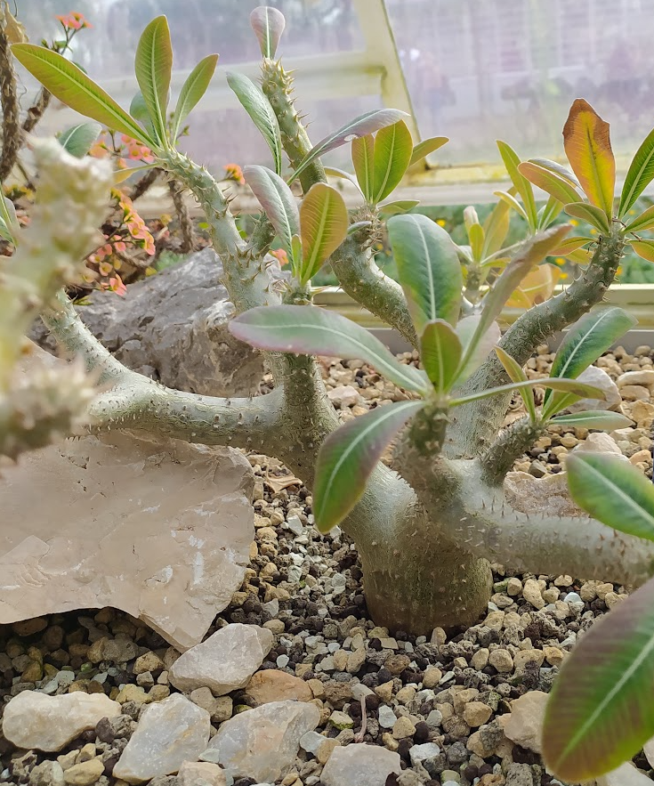
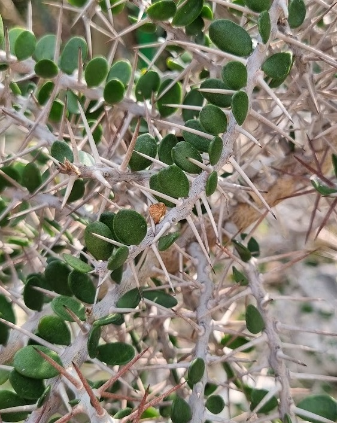

Succulents are a big, widespread family of plants comprising a variety of different species. Their extraordinary
adaptations to draining, extreme conditions are worth a closer look.

## Habitat

Succulents mostly inhabit the harsh desert climates of South Africa, South America and southern North America.
Therefore, they need to handle the following:

- Limited water supply - in some regions below 30mm of rain annually
- Strong exposure to sun
- Herbivores - especially since the habitat is characterized by food scarcity

The extreme conditions of the niche caused extreme evolutionary pressure, which, in turn, led to enormous phenotype
adaptations.

## Preserving water

Since the water supply is limited, succulents evolved their namesake - **Succulency** (Greek: _sucus_ - juice,
_ulentus_ - plenty). It is the ability to **store large amounts of water inside plants**. Starting from a regular tree
form, the succulents adapted to store water in different ways.

## Stem succulents

These preserve water in their trunks and branches. One solution is increasing the thickness of the trunk and branches.
It leads to the plant looking like a malformed tree - like in the case of a baobab (a.k.a monkey bread tree)

Baobab (_Adansonia digitata_) trees in Madagascar - stem succulents.

Incidentally, even the mighty baobab trees with their succulency can't protect themselves from global warming.
Since the beginning of the 21st century we are witnessing an unprecedented baobab die-off in South Africa. The trees
collapse, completely arid inside. One of the species, _Adansonia perrieri_, is considered "Critically Endangered", with
less than 200 mature trees remaining. Sadly, it is expected it goes extinct in the wild soon.

As an aside, scientists are collecting the baobab DNA in search of traits such as drought tolerance, that might be bred
into future trees.[1]

Other examples include the _pachypus_ (Greek: _pachys_ - thick, _pous_ - feet) plants. Some of them look like trees with
wide branches, others form a more extreme rock-like trunk with liana-like branches. The latter are also called caudex
plants. It's also worth noting that the word _pachy_ is often found in the taxonomy of the succulents due to their
looks.

_Pachypodium horombens_ plant - endemic to Madagascar.

_Cyphostemma pachypus_ plant. The stem is rock-solid. Those plants are sometimes referred to as "
living rocks".

The examples above grow non-succulent leaves to photosynthesize. The benefit of this solution is a separation of
concerns. Since the mass and energy transfer is conducted by the leaves, the stem and branches can strongly specialize
in impermeability. This leads to another adaptation: a dense, wax coat on the surface of the bark.

This adaptation is primarily seen in the plants inhibiting the driest regions. Such as _Monsonia_ family, a shrub found
in the dry region of Lüderitz, Namibia. The plant was thoroughly described by Kurt Moritz Dinter, a German scientist,
who worked in that area at the turn of 20th century. He claimed, that the shrubs were able to grow on an exposed
bedrock, surrounded by dunes and their waxy bark was used as tinder or even as an ingredient of candles.

## Cacti

Another solution is conducting photosynthesis in the stem and branches. In this case, the stem has to be permeable,
which reduces the water retention capabilities. On the upside, the plant needs no leaves. This solution was evolved by
the cacti (_Cactaceae_) family.

Cacti are native to Americas and span both continents.
This information immediately tells us, that their adaptations evolved after the separation of Americas and Eurasia. The only representative of the cacti family
in the Old World is
an epiphytic species _Rhipsalis baccifera_. It is believed
to have been introduced by migratory birds.

Back to the photosynthesis. Cacti need to inhale CO2 via their stem. They do this through tiny openings called
_stomata_. When stomata are open, they release water vapour from the plant. To minimize the losses, cacti leverage the
day-night cycle and only open the stomata after sunset. The stomata are also typically slightly sunken into the surface.
It protects from the wind and provides shade.

The photosynthesis requires sunlight, so cacti need to store the CO2, which is gathered at night, until daylight. They
store it in the form of a malic acid. Keep in mind that storage and transformations requires energy. That's why "Normal"
plans simply gather CO2 during the day and perform photosynthesis on the spot.

To further protect the succulent part of the stem from sun exposure and water loss, cacti often take the shape of a star-like cross-section (see below). This
way, the less vital parts protect the stem's core from heating. Below is a cross-section of a cactus' stem. Throughout the year, cacti get thicker and thinner,
basing on their water content.

A cross-section of a cactus. Left - freshly cut, full of water. Right - dried out.

## Leaf succulents

The aforementioned Kurt Dinter also describes _Augea capensis_ - a so-called leaf succulent. This type of succulents evolved succulency in their leaves. Common
leaf succulents are Aloes and Agaves.

A small
Augea shrub can weigh 4 kilograms and a human is able to squeeze 2 liters of water out of it with bare hands.
The water will however not help surviving on the south-african desert due to its saltiness.The reason why the water contains so much salt is that the plants
developed a phenomenal way of storing the water. They use hygroscopic properties of the salt
to bind water inside the leaf and minimize the losses due to vaporizing.

_Augea capensis_ - A leaf succulent. As seen on the picture, it grows in the harshest of climates.

## Spines and thorns

To deter the herbivores, succulents developed several techniques. One of them are spines - the hallmark of the cacti family. Spines are a good example of
convergent evolution since they evolved from different parts of plants for different, isolated, plant groups.

I mentioned that cacti do not need leaves, since their stem and branches are responsible for photosynthesis. This allowed them to repurpose the leaves. What
they grow instead are spikes, which are strongly altered vestigial leaves. The spines are growing on so-called areoles - points on the surface of the branches,
which evolved from branch buds. Some cacti grow glochids - hair-like, small spines. While not as strong as spines, they are extremely irritating and difficult
to get rid of once caught.

Spines on a Trichocereus (left) vs glochids on Opuntia (right). The flat shape of Opuntia segments might resemble leaves but those are
also branches. They evolved to limit the sun exposure by limiting the projection surface.

A convergent solution are thorns. Those can be found on the succulents from the Euphorbiaea family.
While they serve the same role as cactus' spines, the thorns grow directly on the branch.
Interestingly, some species grow both thorns and leaves - something not seen in the cacti family.

Thorns on the branches of a succulent from Didireaceae family

--- 

Euphorbia: Niektóre mają Milki Sap "wolf's milk". biały, caustic, trujący. Tylko kilka zwierząt je dzięki temu wpierdala

Orchidee typowo trzymają wodę w pniach ale mogą też być sukulnentne w liściach
Orchid seeds - poczytaj.

## Seeds

Uncarina. Uncarina ma pojebane owoce!! Masz fote odpowiedniego ustępu.

## Growth Patterns

Trzymana woda pozwala im kwitnąć podczas suchego sezonu.

w afryce jest dużo Spurges (Euphorbiaceae), mają gigantyczny rozrzut:

- np green, succulent stems, vestigial leaves
- ale też thornless stem succulents z niesukulentnymi liśćmi a zamiast tego rhizomes albo korzenie/pnie, które są
  Limit annual growth do minimum. Kilka kwiatków i malutkich liści. Tylko na tyle, żęby dojrzał owoc.

Obczaj:

- euphorbia boranensis (ethipia i kenia native)
- euphorbia candelabrum (east africa)
  E. echinus też. (marocco, atlas mountains)
- Jeste też sporo Asphodelaceae (aloesy). Np Aloe pillansii ma 10m, wygląda jak drzewo.połudine/płd-wsch afryka (
  madagaskar tez). (asphodel family lol).
  Agave v Aloe: Agave mają szorstkie, włókniste fibres. Aloes soft/no fibres, bez thorna na końcu, mają czasem ząbki na
  boku.

Wzrost - Agave americana: flower spike rośnie aż 1cm na godzine.
Cereus jamacaru - segmenty ok 50cm, rosną podczas growing season.
Aloe pillansi - ponad 10m i koło 380 lat żyje.
U samych kaktusów: Pachycereus pringlei ponad 10m, Blossfeldia lilipuntana 2cm max..
drzewiaste aloesy
Pomiar wzrostu:
nie ma completely woody stem u kaktusów i euphorbia -> no growth rings. Dlatego badamy constrictions między stem
segmentami - u cereus jamacaru jes to kurwa trywialne.

### Madagaskar:

### Drzewne sukulenty

[1] https://www.nationalgeographic.com/environment/article/madagascar-baobab-trees-deforestation-climate-change#:~:text=Of%20baobab%20trees%2C%20the%20Adansonia,species%20could%20be%20lost%20forever.

https://enjoysucculents.com/2017/01/09/augea-capensis/
