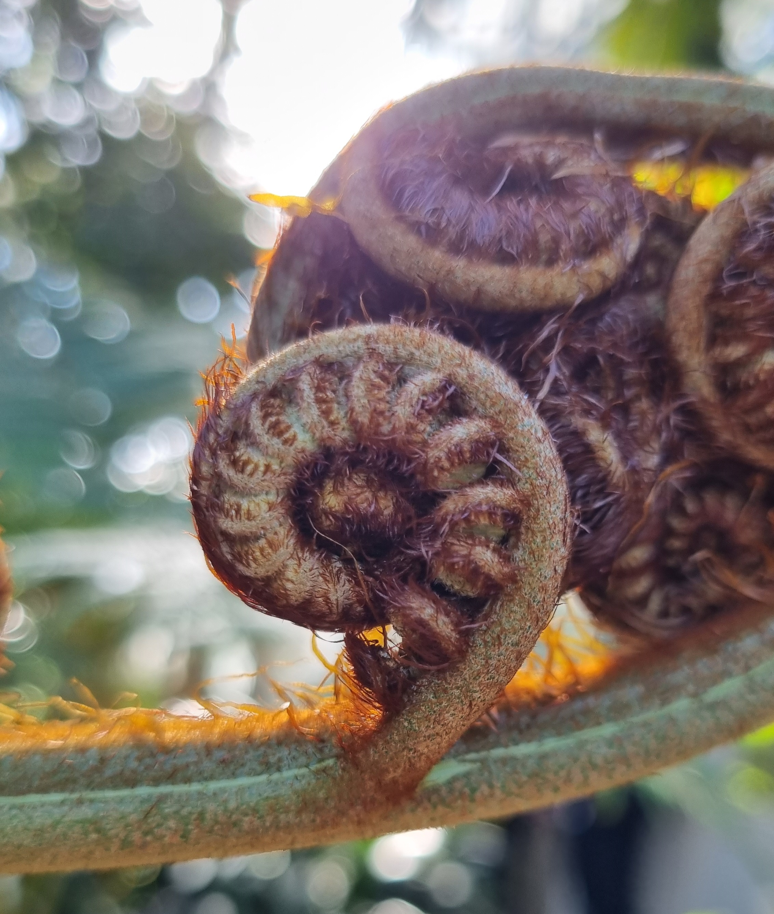
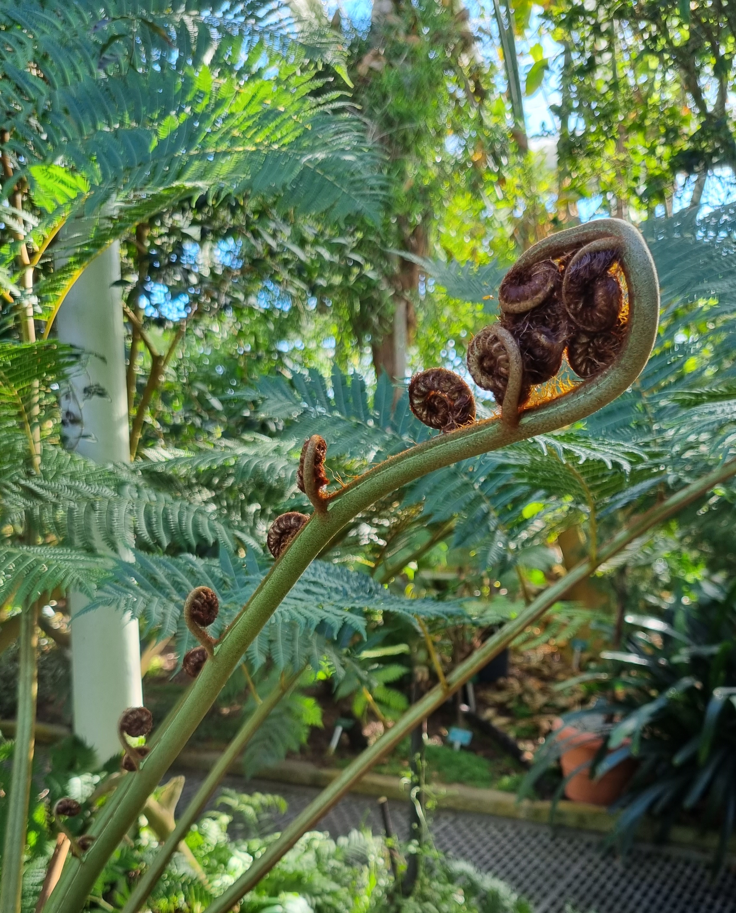

---
#
# By default, content added below the "---" mark will appear in the home page
# between the top bar and the list of recent posts.
# To change the home page layout, edit the _layouts/home.html file.
# See: https://jekyllrb.com/docs/themes/#overriding-theme-defaults
#
layout: home
---
# Welcome to *Chaotic Notes* 🎉

A personal collection of nature's intricacies that I love to gather and curate.

Stay awhile and ponder with me! ☕

## Entries:

---

### Fractals

Fractals can be defined as infinitely complex patterns that are self-similar across different scales. A fractal-like shapes (albeit not infinite) can be seen in the nature. Below is a close-up of a leaf of a tree fern *Cyathea cooperi*. The spirals, also called *crosiers* (due to their resemblence to the Bishops' staves) is padded with a delicate covering of brown, silky hair. It grows on the converging end and finally unwinds, transforming into what looks like an ordinary fern leaf.

The unwound leaves can be seen in the background of the picture below. Notice how the stem itself resembles the shape of the spiral frozen in the process of unraveling (especially at the tip), adding another dimension to the fractal form.

[Source: The Palm House, Natural History Museum of Denmark, Copenhagen]

---

